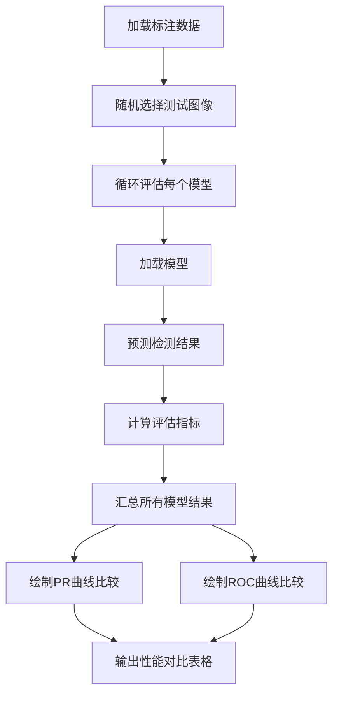

# YOLO模型评估逻辑与参数计算

## 1. 简介

这个评估脚本(`eval_yolo_coco.py`)用于比较不同YOLO模型在人体检测任务上的性能。它能够同时评估多个模型，并生成直观的对比图表，帮助选择最适合特定应用场景的模型。

## 2. 工作流程概述



## 3. 数据准备与处理

### 3.1 配置初始化

```python
# 模型配置
MODEL_PATHS = [
    "./models/yolov8m-pose.pt",  # medium
    "./models/yolov8n-pose.pt",  # nano
    "./models/yolov8s-pose.pt"   # small
]
MODEL_NAMES = ["YOLOv8-m", "YOLOv8-n", "YOLOv8-s"]
MODEL_COLORS = ['red', 'blue', 'green']

# 评估参数
NUM_SAMPLES = 1000  # 评估的图像数量
IOU_THRESHOLD = 0.5  # 判定正确检测的IoU阈值
```

### 3.2 标注数据加载与处理

1. 加载自定义格式的JSON标注文件
2. 提取图像信息和人体边界框标注
3. 创建图像ID到标注的映射
4. 随机选择指定数量的图像用于评估

```python
# 创建图像ID到标注的映射
image_to_annotations = {}
image_id_to_file = {}

for img_data in images:
    img_id = img_data["image_id"]
    file_name = img_data["file_name"]
    annotations = img_data.get("annotations", [])
    
    image_to_annotations[img_id] = annotations
    image_id_to_file[img_id] = file_name

# 随机选择图像
selected_image_ids = random.sample(all_image_ids, min(NUM_SAMPLES, len(all_image_ids)))
```

## 4. 模型评估流程

### 4.1 单模型评估过程 (`evaluate_model`函数)

1. **加载模型**：使用ultralytics库加载YOLO模型
2. **获取预测结果**：对每张测试图像进行推理
3. **真实标签匹配**：计算预测框与真实框的IoU，寻找最佳匹配
4. **计算评估指标**：基于匹配结果计算性能指标
5. **返回评估结果**：返回PR曲线、ROC曲线数据及AP、AUC值

### 4.2 IoU计算 (交并比)

IoU用于衡量预测框与真实框的重叠程度：

```python
# 计算两个框的IoU
def calculate_iou(box1, box2):
    # 计算交集
    x1 = max(box1[0], box2[0])
    y1 = max(box1[1], box2[1])
    x2 = min(box1[2], box2[2])
    y2 = min(box1[3], box2[3])
    
    if x2 < x1 or y2 < y1:
        return 0.0
    
    intersection = (x2 - x1) * (y2 - y1)
    
    # 计算各自面积
    box1_area = (box1[2] - box1[0]) * (box1[3] - box1[1])
    box2_area = (box2[2] - box2[0]) * (box2[3] - box2[1])
    
    # 计算并集
    union = box1_area + box2_area - intersection
    
    return intersection / union
```

IoU阈值（默认0.5）用于判断检测是否正确：
- IoU ≥ 0.5：认为是正确检测（TP）
- IoU < 0.5：认为是错误检测（FP）

## 5. 预测边界框的存储与比较详解

### 5.1 边界框数据结构设计

在评估过程中，预测的边界框(bbox)信息需要以结构化方式存储。脚本采用了字典列表的数据结构：

```python
predictions = []  # 用于存储所有预测结果

# 每个预测结果被表示为一个包含多个字段的字典
prediction = {
    'img_id': img_id,           # 图像ID，用于追踪预测来源
    'confidence': score,        # 检测置信度分数
    'iou': best_iou,            # 与最匹配真实框的IoU值
    'matched_gt': best_iou >= 0.5,  # 是否匹配到真实标签（布尔值）
    'matched_gt_idx': best_gt_idx   # 匹配到的真实标签索引
}
predictions.append(prediction)
```

这种设计有以下优势：
1. **完整性**：保留所有必要的信息用于后续评估
2. **灵活性**：可以轻松添加其他字段进行扩展
3. **可追溯性**：预测结果可以追溯到源图像和匹配的真实标签
4. **易处理性**：便于排序、过滤和聚合操作

### 5.2 从YOLO模型提取预测结果

从YOLO模型的原始输出中提取边界框信息的过程：

```python
# 提取YOLO预测结果
for img_id in selected_image_ids:
    # 加载图像
    image_path = os.path.join(TRAIN_IMAGES_PATH, image_id_to_file[img_id])
    
    # 使用YOLO模型预测
    results = model.predict(image_path)
    result = results[0]  # 获取第一个结果对象
    
    # 提取预测框信息
    pred_boxes = []  # 存储预测框坐标 [x1,y1,x2,y2]
    pred_scores = [] # 存储置信度分数
    
    for box in result.boxes:
        xyxy = box.xyxy[0].tolist()  # 获取[x1,y1,x2,y2]格式坐标
        class_id = int(box.cls.item())  # 获取类别ID
        confidence = box.conf.item()    # 获取置信度
        
        # 只保留人类预测 (类别ID为0)
        if class_id == 0:
            pred_boxes.append(xyxy)
            pred_scores.append(confidence)
```

YOLO模型的原始输出包括：
- 边界框坐标（xyxy格式：左上和右下坐标）
- 类别ID
- 置信度分数

我们只保留人类检测结果（类别ID=0），这样可以聚焦于人体检测性能评估。

### 5.3 预测框与真实框的匹配算法

匹配算法的核心是为每个预测框找到最匹配的真实框：

```python
# 为每个预测框寻找最佳匹配的真实框
for i, pred_box in enumerate(pred_boxes):
    best_iou = 0            # 初始化最佳IoU为0
    best_gt_idx = -1        # 初始化最佳匹配索引为-1
    
    # 遍历所有真实框，寻找最佳匹配
    for j, gt_box in enumerate(gt_boxes):
        # 计算当前预测框与真实框的IoU
        current_iou = calculate_iou(pred_box, gt_box)
        
        # 如果IoU更高，则更新最佳匹配
        if current_iou > best_iou:
            best_iou = current_iou
            best_gt_idx = j
    
    # 记录此预测框的匹配信息
    predictions.append({
        'img_id': img_id,
        'confidence': pred_scores[i],
        'iou': best_iou,
        'matched_gt': best_iou >= IOU_THRESHOLD,  # 是否超过IoU阈值
        'matched_gt_idx': best_gt_idx if best_gt_idx >= 0 else None
    })
```

匹配算法的关键步骤：
1. 对于每个预测框，计算与所有真实框的IoU
2. 选择IoU最高的真实框作为最佳匹配
3. 如果最佳IoU≥阈值(通常0.5)，则认为匹配成功
4. 记录匹配结果，包括IoU值和真实框索引

注意：这种匹配方法是**局部最优**的，即为每个预测框独立寻找最佳匹配，而不考虑全局最优匹配。

### 5.4 TP和FP的判定机制

真阳性(TP)和假阳性(FP)的判定过程是评估的核心：

```python
# 按置信度从高到低排序预测结果
sorted_preds = sorted(predictions, key=lambda x: x['confidence'], reverse=True)

tp = np.zeros(len(sorted_preds))  # 初始化TP数组
fp = np.zeros(len(sorted_preds))  # 初始化FP数组
matched_gt = set()  # 已匹配的真实标签集合，避免重复匹配

# 按置信度从高到低处理每个预测
for i, pred in enumerate(sorted_preds):
    # 提取关键信息
    img_id = pred['img_id']
    gt_idx = pred['matched_gt_idx']
    iou = pred['iou']
    
    # 生成唯一标识符，用于跟踪已匹配的真实框
    img_gt_key = f"{img_id}_{gt_idx}" if gt_idx is not None else None
    
    # 判断是否为TP
    if iou >= IOU_THRESHOLD and pred['matched_gt'] and img_gt_key is not None:
        # 检查此真实框是否已被更高置信度的预测匹配
        if img_gt_key not in matched_gt:
            tp[i] = 1  # 标记为TP
            matched_gt.add(img_gt_key)  # 记录已匹配真实框
        else:
            fp[i] = 1  # 重复匹配，标记为FP
    else:
        fp[i] = 1  # IoU不足或未匹配，标记为FP
```

TP/FP判定的关键规则：
1. **置信度优先**：按置信度从高到低处理预测，高置信度预测优先匹配真实框
2. **唯一匹配**：每个真实框只能被匹配一次，重复匹配视为FP
3. **IoU阈值**：只有IoU≥阈值的匹配才视为有效
4. **完整覆盖**：所有预测都必须分类为TP或FP

这种判定机制符合PASCAL VOC和COCO等标准评估协议，确保评估的公平性和可比性。

### 5.5 不同模型预测结果的比较方法

在评估多个模型时，需要单独处理每个模型的预测，然后收集结果进行比较：

```python
# 为每个模型执行评估并收集结果
all_results = []
for i, (model_path, model_name) in enumerate(zip(MODEL_PATHS, MODEL_NAMES)):
    # 评估单个模型
    results = evaluate_model(model_path, model_name)
    
    if results is not None:
        precision, recall, fpr, tpr, ap, roc_auc = results
        # 存储模型结果
        all_results.append({
            'name': model_name,
            'precision': precision,  # 精确率曲线数据
            'recall': recall,        # 召回率曲线数据
            'fpr': fpr,              # 假阳性率曲线数据
            'tpr': tpr,              # 真阳性率曲线数据
            'ap': ap,                # 平均精度值
            'auc': roc_auc,          # ROC曲线下面积
            'color': MODEL_COLORS[i] # 图表中使用的颜色
        })
```

比较不同模型时的关键考量：
1. **一致的评估集**：所有模型使用相同的测试图像和标注
2. **相同的评估标准**：使用相同的IoU阈值和评估指标
3. **可视化对比**：在同一图表中绘制不同模型的性能曲线
4. **量化比较**：通过AP和AUC等单一数值指标进行直接比较

## 6. 关键参数计算方法

### 6.1 TP (真阳性) 与 FP (假阳性)

```python
# 按置信度降序排列预测结果
sorted_preds = sorted(preds, key=lambda x: x['confidence'], reverse=True)

tp = np.zeros(len(sorted_preds))
fp = np.zeros(len(sorted_preds))
matched_gt = set()  # 已匹配的真实标签集合

for i, pred in enumerate(sorted_preds):
    if pred['iou'] >= iou_threshold and pred['matched_gt']:
        # 确保一个真实框只匹配一次
        img_gt_key = f"{pred['img_id']}_{pred['matched_gt_idx']}"
        if img_gt_key not in matched_gt:
            tp[i] = 1  # 真阳性
            matched_gt.add(img_gt_key)
        else:
            fp[i] = 1  # 重复检测，假阳性
    else:
        fp[i] = 1  # 未匹配到真实框或IoU不足，假阳性
```

### 6.2 精确率 (Precision) 与召回率 (Recall)

精确率和召回率是评估目标检测模型的两个基本指标：

- **精确率**: 正确检测结果占所有检测结果的比例
  ```
  Precision = TP / (TP + FP)
  ```

- **召回率**: 正确检测结果占所有真实目标的比例
  ```
  Recall = TP / 所有真实标签数
  ```

代码实现：
```python
# 计算累积值
tp_cumsum = np.cumsum(tp)
fp_cumsum = np.cumsum(fp)

# 计算精确率和召回率
precision = tp_cumsum / (tp_cumsum + fp_cumsum + 1e-10)  # 添加小值防止除零
recall = tp_cumsum / num_gts  # num_gts为真实标签总数
```

### 6.3 AP (平均精度)

AP是PR曲线下的面积，用于量化模型在不同精度-召回率平衡点的整体性能：

```python
def calculate_ap(precision, recall):
    # 使用PASCAL VOC方法计算AP
    mrec = np.concatenate([[0], recall, [1]])  # 添加起点和终点
    mpre = np.concatenate([[0], precision, [0]])
    
    # 平滑处理（取右侧最大值）
    for i in range(len(mpre)-2, -1, -1):
        mpre[i] = max(mpre[i], mpre[i+1])
    
    # 计算PR曲线下面积
    indices = np.where(mrec[1:] != mrec[:-1])[0] + 1
    ap = np.sum((mrec[indices] - mrec[indices-1]) * mpre[indices])
    
    return ap
```

### 6.4 ROC曲线与AUC

ROC曲线展示了不同阈值下TPR (真阳性率) 与FPR (假阳性率) 的关系：

- **TPR**: 真阳性率，等同于召回率
  ```
  TPR = TP / (TP + FN)
  ```

- **FPR**: 假阳性率，错误检测的比例
  ```
  FPR = FP / (FP + TN)
  ```

- **AUC**: ROC曲线下的面积，量化模型区分能力

```python
# 计算ROC曲线
fpr, tpr, _ = roc_curve(labels, confidences)
roc_auc = auc(fpr, tpr)
```

## 7. 结果可视化

### 7.1 PR曲线对比

PR曲线展示了模型在不同置信度阈值下的精确率和召回率平衡：
- X轴：召回率 (0~1)
- Y轴：精确率 (0~1)
- 曲线越接近右上角，性能越好
- 图例显示各模型的AP值

```python
plt.figure(figsize=(12, 9))
for result in all_results:
    plt.plot(result['recall'], result['precision'], color=result['color'], 
             linewidth=2, label=f"{result['name']} AP={result['ap']:.3f}")
```

### 7.2 ROC曲线对比

ROC曲线展示了模型的区分能力：
- X轴：假阳性率 (0~1)
- Y轴：真阳性率 (0~1)
- 曲线越接近左上角，性能越好
- 图例显示各模型的AUC值

## 8. 使用指南

### 8.1 选择合适的模型

基于评估结果，可以根据不同需求选择合适的模型：

1. **追求高精度**：选择AP值较高的模型
2. **追求实时性**：在性能满足的情况下，选择较小的模型（nano > small > medium）
3. **平衡性能与速度**：参考AP值和模型大小，寻找最佳平衡点

### 8.2 调整置信度阈值

可以根据PR曲线，为特定应用场景选择合适的置信度阈值：

- **高精度优先**：选择曲线上精度较高的点（通常对应较高置信度阈值）
- **高召回率优先**：选择曲线上召回率较高的点（通常对应较低置信度阈值）
- **平衡精度与召回率**：选择曲线拐点附近的阈值

### 8.3 实际应用场景

- **安全监控**：可能优先考虑高召回率，确保不错过任何人
- **人流统计**：可能需要平衡精度和召回率
- **特定场景优化**：可根据具体应用需求调整阈值

## 9. 实际应用中的优化建议

### 9.1 预测存储优化

对于大规模评估场景，可以考虑以下优化方法：

1. **批量处理**：分批处理图像，减少内存占用
   ```python
   # 批量处理示例
   batch_size = 16
   for i in range(0, len(selected_image_ids), batch_size):
       batch_ids = selected_image_ids[i:i+batch_size]
       # 处理此批次...
   ```

2. **稀疏存储**：只保存必要的信息，减少内存占用
   ```python
   # 只保存高于一定置信度的预测
   if confidence > min_confidence:
       predictions.append({...})
   ```

3. **并行处理**：利用多进程加速评估过程
   ```python
   from multiprocessing import Pool
   
   with Pool(processes=4) as pool:
       results = pool.map(process_image, selected_image_ids)
   ```

### 9.2 匹配算法改进

标准的贪婪匹配算法可能不是最优的，可以考虑以下改进：

1. **匈牙利算法(Hungarian Algorithm)**：寻找全局最优匹配
   ```python
   from scipy.optimize import linear_sum_assignment
   
   # 构建成本矩阵
   cost_matrix = np.zeros((len(pred_boxes), len(gt_boxes)))
   for i, pred_box in enumerate(pred_boxes):
       for j, gt_box in enumerate(gt_boxes):
           cost_matrix[i, j] = 1 - calculate_iou(pred_box, gt_box)  # 转换为成本(越小越好)
   
   # 使用匈牙利算法找到最优匹配
   pred_indices, gt_indices = linear_sum_assignment(cost_matrix)
   ```

2. **多IoU阈值评估**：使用多个IoU阈值(如0.5,0.75,0.95)进行综合评估
   ```python
   # COCO风格评估，使用多个IoU阈值
   iou_thresholds = [0.5, 0.55, 0.6, 0.65, 0.7, 0.75, 0.8, 0.85, 0.9, 0.95]
   ap_values = []
   
   for iou_threshold in iou_thresholds:
       # 使用特定IoU阈值计算AP
       ap = calculate_ap_at_iou(predictions, ground_truths, iou_threshold)
       ap_values.append(ap)
   
   # 计算mAP (多个IoU阈值下AP的平均值)
   mean_ap = np.mean(ap_values)
   ```

### 9.3 高级性能分析

除了基本的AP和AUC指标外，还可以进行更深入的性能分析：

1. **错误分析**：将FP分类为不同类型的错误
   - 定位错误：IoU在0.1~0.5之间，说明定位不够精确
   - 背景错误：IoU接近0，说明将背景误检为人
   - 重复检测：已有更高置信度的预测匹配了同一真实框

2. **困难样本分析**：识别模型表现不佳的情况
   - 小目标：面积较小的人体检测困难
   - 遮挡：被部分遮挡的人体检测困难
   - 光照：极端光照条件下的检测性能

3. **置信度校准**：分析模型置信度与实际准确性的关系
   ```python
   # 将置信度划分为若干区间
   confidence_bins = np.linspace(0, 1, 11)  # 0.0, 0.1, 0.2, ..., 1.0
   
   # 计算每个区间内的准确率
   for i in range(len(confidence_bins)-1):
       min_conf = confidence_bins[i]
       max_conf = confidence_bins[i+1]
       
       # 筛选此区间内的预测
       bin_preds = [p for p in predictions if min_conf <= p['confidence'] < max_conf]
       
       # 计算此区间内的准确率
       accuracy = sum(1 for p in bin_preds if p['matched_gt']) / (len(bin_preds) + 1e-10)
       
       # 理想情况下，置信度应该接近准确率
       calibration_error = abs(accuracy - (min_conf + max_conf)/2)
   ```

## 10. 总结

通过这个评估脚本，我们可以:
1. 客观比较不同YOLO模型在人体检测任务上的性能
2. 基于AP、AUC等指标选择最适合特定应用的模型
3. 根据PR曲线调整最佳置信度阈值
4. 在性能和速度之间找到最佳平衡点

评估过程的核心是准确存储和比较预测边界框，通过精心设计的数据结构和匹配算法，我们可以全面评估模型在人体检测任务上的性能，为实际应用提供科学依据。 